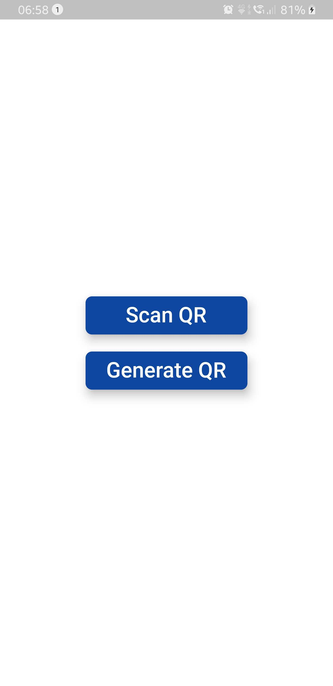

# QR Code Example

Flutter app for demonstrating of generating and scanning QR Code .

## Getting Started

This project is just a demo of how you can generate, share and scan QR Code.

For this demo project, we require some permissions like **storage** to save shareable QR image and **camera** for scanning QR image.

## Dependencies Utilized

There are several dependencies which are utilised in this project to accomplish the task:

- [qr_flutter](https://pub.dev/packages/qr_flutter)
- [qr_code_scanner](https://pub.dev/packages/qr_code_scanner)
- [path_provider](https://pub.dev/packages/path_provider)
- [flutter_share](https://pub.dev/packages/flutter_share)
- [permission_handler](https://pub.dev/packages/permission_handler)

We have qr_flutter dependency for forming QR code and qr_code_scanner for scanning QR code.

For more help you can go to 
[QR Flutter](https://pub.dev/packages/qr_flutter) or [QR Scanner](https://pub.dev/packages/qr_code_scanner) raise the issue in this repo.

